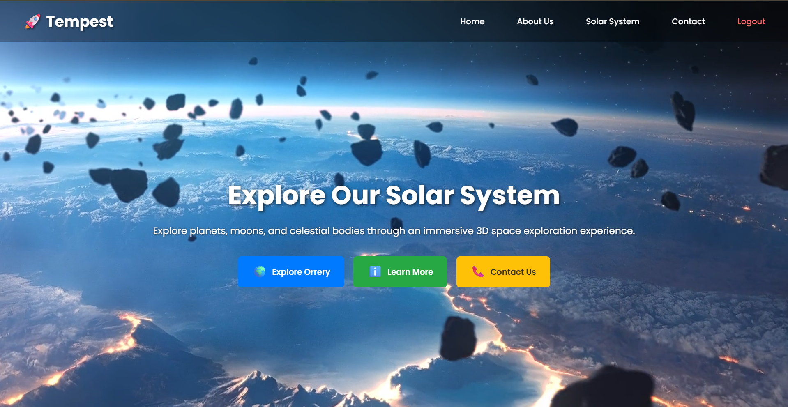
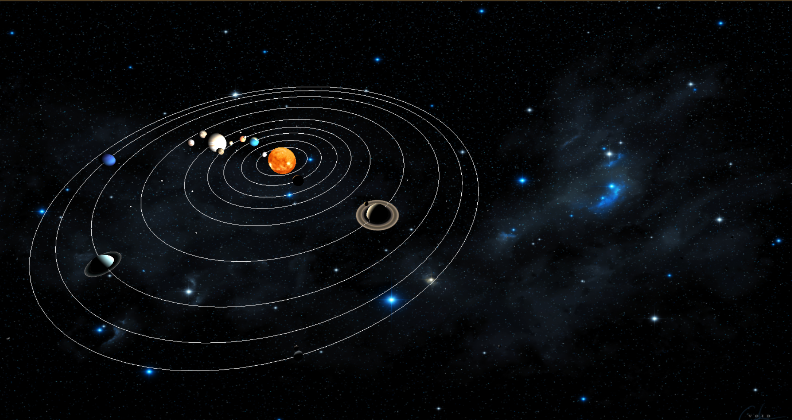
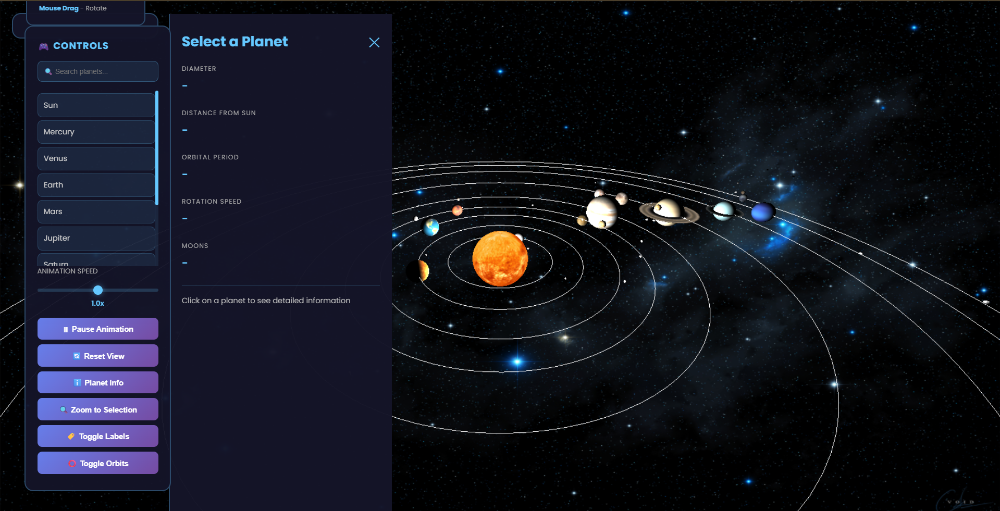

# 🚀 NASA Space Apps Hackathon – Interactive Solar System Orrery

An interactive 3D Solar System visualization built using Three.js, allowing users to explore planets, moons, orbital paths, and celestial objects in an immersive environment.

## 🌌 Features

* Interactive 3D Solar System
* Realistic Planet Textures
* Planetary Rotation & Revolution
* Planet Information Panel
* Zoom to Selected Planet
* Planet Search Functionality
* Toggle Planet Labels
* Toggle Orbital Paths
* Animation Controls
* Asteroid Belt Visualization
* Responsive User Interface

## 🪐 Included Celestial Bodies

* Sun
* Mercury
* Venus
* Earth
* Mars
* Jupiter
* Saturn
* Uranus
* Neptune
* Pluto
* Planetary Moons
* Asteroid Belt

## 🛠️ Tech Stack

### Frontend

* HTML5
* CSS3
* JavaScript (ES6)

### 3D Visualization

* Three.js
* OrbitControls
* OBJLoader

### Backend

* Node.js
* Express.js

### Database & Authentication

* MySQL
* bcrypt.js


## 📸 Screenshots

### Home Page

Interactive landing page for exploring the Solar System through an immersive 3D experience.



---

### Interactive Solar System Orrery

Complete 3D visualization of the Solar System with planetary orbits and celestial bodies.



---

### Planet Information & Controls

Search planets, view detailed information, control animations, and navigate the Solar System.




## 🚀 Installation

```bash
git clone https://github.com/Ajinkya7890/Nasa-SpaceApp-Hackathon.git

cd Nasa-SpaceApp-Hackathon

npm install

npm start
```

Open in browser:

```text
http://localhost:4000
```

## 📂 Project Structure

```text
Nasa-SpaceApp-Hackathon
│
├── Orrery-Web-App-main
├── assets
├── image
├── image_planets
├── media
├── earth
├── login.js
├── index.html
├── welcome.html
└── README.md
```

## 📜 License

This project is intended for educational and learning purposes.
